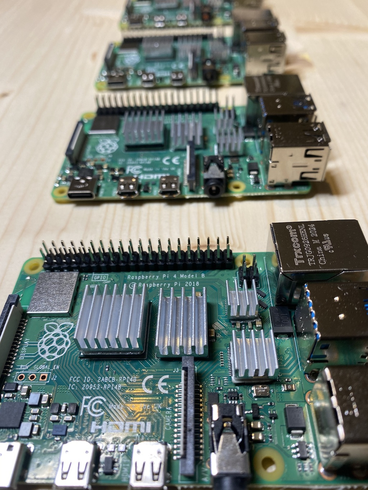

# Exécution d'un noeud complet dockerisé sur un Raspberry Pi 4

Dans ce guide, nous allons apprendre :

- Comment installer un Raspberry Pi 4
- Comment exécuter une instance dockerisée d'Alephium

## Comment installer un Raspberry Pi 4

Cette première section détaillera ma façon personnelle d'installer un serveur Ubuntu 20.04 sur un Raspberry Pi 4.
Cela nécessite d'avoir un Raspberry Pi 4 (évidemment), une carte SD (8 GB est le minimum) et un lecteur de carte SD pour flasher la carte SD.
Elle sera illustrée à l'aide de la commande shell de macOS, mais vous trouverez l'équivalent sous Windows.

[Se préparer pour le travail](media/flashing.jpeg)

Tout d'abord, nous allons configurer l'installation Ubuntu. Nous utilisons cloud-init pour cela puisqu'il est intégré dans Ubuntu 20.04 et plus.
Cette configuration crée un utilisateur (différent du `ubuntu` par défaut) et installe quelques paquets.

### Configurer le démarrage

Mettez le snippet ci-dessous dans un fichier nommé `user-data.yml` et sauvegardez-le. Celui-ci crée un utilisateur `alephium` avec le mot de passe `installfest2021`.
Vous pouvez personnaliser le contenu de ce fichier si vous savez ce que vous faites.

```yaml
#cloud-config

hostname: alephium

ssh_pwauth: true

users:
  - name: alephium
    gecos: "alephium"
    sudo: ALL=(ALL) NOPASSWD:ALL
    shell: /bin/bash
    groups: adm,sudo,docker
    plain_text_passwd: installfest2021
    lock_passwd: false
    chpasswd: { expire: false }
#    ssh_authorized_keys: # Optionally ad ssh key here, if you don't want the password.
#      - ssh-ed25519 xxxxxxxxxxxxxxxxxx

packages:
  - apt-transport-https
  - ca-certificates
  - curl
  - gnupg-agent
  - software-properties-common
  - git
  - openssh-server
  - docker.io
  - docker-compose

runcmd:
  - systemctl start docker
  - systemctl enable docker

package_update: true
package_upgrade: true

power_state:
  mode: reboot
```

### Flash la carte SD

Maintenant, nous allons flasher la carte SD en incluant ce fichier `user-data.yml`.

J'utilise l'outil [flash](https://github.com/hypriot/flash/) pour cela, qui fait le travail pour vous.

```shell
curl -LO https://github.com/hypriot/flash/releases/download/2.7.2/flash
chmod +x flash

./flash --userdata user-data.yml https://cdimage.ubuntu.com/releases/20.04/release/ubuntu-20.04.4-preinstalled-server-arm64+raspi.img.xz
```

La commande ci-dessus vous demandera de confirmer que `/dev/disk2` est la carte SD et non votre disque dur, et vous demandera votre mot de passe car flasher une carte SD nécessite des privilèges d'administrateur.

Une fois la commande ci-dessus terminée, vous pouvez insérer la carte SD dans votre Raspberry Pi et l'allumer.
Il faut une poignée de minutes pour que le premier démarrage s'exécute complètement, et votre Raspberry Pi est prêt à être utilisé.
Une fois que le noeud est prêt, vous pouvez y accéder en utilisant `alephium` comme nom d'utilisateur, et `installfest2021` comme mot de passe !

```shell
ssh alephium@alephium
```

Si l'hôte `alephium` est inconnu, vous devrez chercher l'adresse IP du noeud, très probablement sur la page/application de configuration de votre routeur.

Et voilà, votre Raspberry Pi fonctionne sous Ubuntu 20.04 avec Docker, et est prêt à exécuter un noeud complet Alephium.

🚀



## Comment faire fonctionner une instance d'Alephium full node sous Docker ?

Cette deuxième section n'est pas spécifique à un Raspberry Pi, mais peut être généralisée à tout serveur/vm/ordinateur ayant un accès SSH.
Nous allons exécuter la version la plus basique d'un noeud complet d'Alephium en utilisant Docker, et ensuite itérer pour rendre notre configuration plus pratique à utiliser.
plus pratique pour travailler.

Comme pré-requis de cette section, nous devons avoir un serveur avec un accès SSH, et plus précisément exécutant Ubuntu 20.04 ou plus récent.
La section précédente explique comment faire cela avec un Raspberry Pi, mais une instance AWS EC2 ferait également l'affaire.

### Connexion au serveur

Cela devrait être une étape facile, en utilisant la commande `ssh`. Exécutez :

```shell
ssh alephium@alephium
```

### Installation de docker et docker-compose

Installons rapidement docker et docker-compose, afin d'être prêts à faire fonctionner le noeud complet Alephium.

Une fois connecté par ssh, exécutez les commandes suivantes :

```shell
sudo apt install -y docker.io docker-compose
```

Super, docker devrait fonctionner :

```shell
docker ps
```

### Exécuter le noeud complet

Maintenant, nous pouvons exécuter le noeud complet, en une seule ligne, comme suit :

```shell
docker run -it --rm -p 12973:12973 --name alephium alephium/alephium:v1.2.6
```

### Docker-compose

Docker-compose est une manière un peu plus pratique d'exécuter un conteneur, surtout si la commande commence à contenir
des volumes, plus de ports, des variables d'environnement, etc...

Donc, ci-dessous est la définition du service que vous pouvez mettre dans un fichier `docker-compose.yml`, et simplement appeler `docker-compose up -d` pour démarrer votre noeud complet à partir de cette définition.

```yaml
version: "3"
services:
  broker:
    image: "alephium/alephium:v1.2.6"
    restart: unless-stopped
    ports:
      - 9973:9973/tcp
      - 9973:9973/udp
      - 10973:10973/tcp
      - 12973:12973/tcp
```

